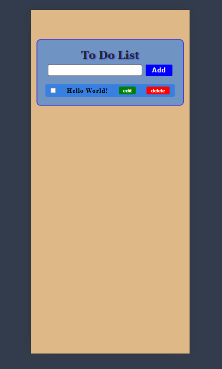
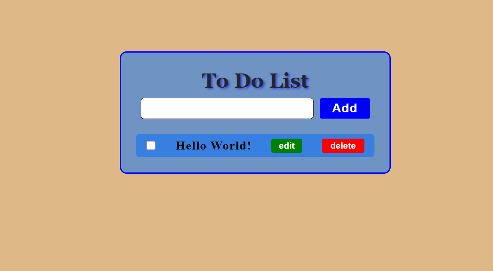

# 📌 To-Do List

This project is a simple and convenient **To-Do List** application created using **HTML, CSS and JavaScript**. ✅

---

## 🚀 Features

- 📝 **Add tasks** – By entering text and clicking the "Add" button.
- ✏️ **Edit tasks** – Modify existing tasks.
- 🗑️ **Delete tasks** – Remove unnecessary tasks from the list.
- 🎨 **Beautiful design** – User-friendly and minimalist interface.

---

## 📷 Screenshots

**📱 Mobile version**

**💻 Desktop version**

---

## 🛠️ Technologies used

- **HTML** – The main structure of the page.
- **CSS** – Design and visual elements.
- **JavaScript** – Dynamic functions and user interaction.

---

## 🎮 Usage

- **Add task**: Enter the task name in the text field and click the "Add" button.
- **Edit task**: Click the "Edit" button next to the existing task, change the text and save.
- **Delete task**: Click the "Delete" button next to the existing task.

---

## 👨‍💻 Author

- **Name**: [Faridunjon Fakhridinov](https://faridun.uz/)
- **Project link**: [To-Do List](https://javascript-to-do-list-orpin.vercel.app/)
---
